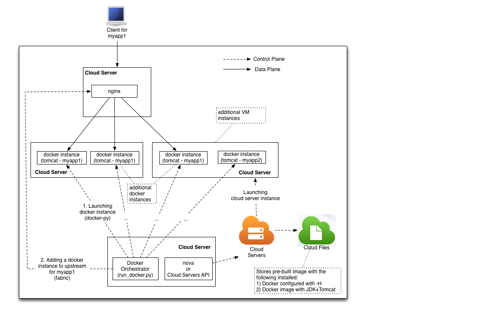

Introduction and Goal
=====================

The goal of this exercise is to use Rackspace public cloud servers as the hosting servers for running docker instances that run tomcat applications.
Each tomcat application runs on multiple docker instances (possibly running on multiple cloud servers) and load balanced by an nginx proxy.

This document gives a high-level details on how one can go about achieving it. See the image below for reference.

Pre-requisites
==============

* All the commands shown are run from a Ubuntu workstation (marked with $). If you are using another platform, you need to modify these accordingly.
* You also need Nova client (https://github.com/openstack/python-novaclient) on this workstation.
* And of course, a Rackspace (public cloud) account to play with.
* Python fabric and docker python bindings

Highlevel plan
==============

1. Create a cloud server and install nginx
2. Create a cloud server and install docker
   a. Create a docker image with JDK+Tomcat
   b. Create a snapshot of this cloud server
   c. Using the snapshot of this cloud server, you can create as many more cloud servers as desired
3. Using provided script (run_docker.py) launch docker with tomcat instances in these cloud server instances. Or you can do this manually:
   a. run an instance of docker+tomcat in chosen cloud server
   b. add the docker instance to list of servers for nginx upstream module and reload nginx
4. Test by browsing to http://nginxhostip

Notes
=====

* The instructions use Ubuntu 13.10, 512MB flavor for all cloud servers.
* The same Ubuntu version is used for docker, though not necessary.

Detailed Steps
==============

1. First create a ssh key pair to use for logging into cloud servers, for example::

    $ ssh-keygen -q -t rsa -f mykey -N ""

2. Create a cloud server to run nginx.

   a. create cloud server::

      $ nova boot --image df27d481-63a5-40ca-8920-3d132ed643d9 --flavor 2 --file /root/.ssh/authorized_keys=mykey.pub mynginx

   b. Wait for the nginx cloud server to start and be active. Use the below command to check the status as well as to get the IP(accessIP4)::

      $ nova show mynginx

   c. In the below commands replace references to mynginx with this IP.

   d. Log into this cloud server, mynginx, and install nginx::

      $ ssh -i mykey root@mynginx

      # apt-get install nginx

   e. Configure nginx by first disabling sites-enabled by commenting out the line "include /etc/nginx/sites-enabled/\*" in /etc/nginx/nginx.conf.

   f. Copy backends, and default.conf to /etc/nginx/conf.d.

   g. You also might want to set up nginx to start on every boot.

   h. restart nginx::

       # service nginx restart

   i. Exit from nginx and get back to your workstation::

       # exit

3. Create a cloud server to install install docker. It will be configured with a docker image that includes JDK+tomcat. 
   The same cloud server is snapshotted so that additional cloud servers can be created from it as necessary

   a) Create server::

      $ nova boot --image df27d481-63a5-40ca-8920-3d132ed643d9 --flavor 2 --file /root/.ssh/authorized_keys=mykey.pub mydkr1

   b) Wait for the mydkr1 to start and ready. You can check the status with below command. Once it is ready, note accessIPv4. 
      In the following instructions use this IP for all references to mydkr1::

      $ nova show mydkr1

   c) Connect to mydkr1::

      $ ssh -i mykey root@mydkr1

   d) Install docker into mydkr1::

      # apt-get update
      # apt-get install linux-image-extra-`uname -r`
      # sh -c "wget -qO- https://get.docker.io/gpg | apt-key add -"
      # sh -c "echo deb http://get.docker.io/ubuntu docker main > /etc/apt/sources.list.d/docker.list"
      # apt-get update
      # apt-get install lxc-docker
   

   e) Update docker configuration so that the daemon binds both unix socket and TCP ports. To access the daemon from a remote client, you need this TCP port. 
      We will use this later to launch new docker instances remotely from a script. Here are the contents of the config file::

        root@mydkr1:~# cat /etc/default/docker
        DOCKER_OPTS="-H unix:///var/run/docker.sock -H tcp://0.0.0.0:5555"

   f) Stop and restart docker to read the new configuration::

        $ service docker stop
        $ service docker start

   g) Verify that docker is correctly installed::

        # docker run -i -t ubuntu /bin/bash

   h) Exit from docker instance. It is shutdown automatically::

        root@f169b69d6370:/# exit

   i) Build a docker image. Start by copying Dockerfile to current directory. This file includes all the instructions to build a docker image with JDK+Tomcat::

        # docker build -t sai/tomcat7 .

   j) Verify that the image functions as expected::

       # docker run -d -p 8080 sai/tomcat7

   k) Get the exposed port mapped to host by running below command. The port is usually 49153::

       # docker ps

   l) Run Curl to verify::

       # curl -X GET http://localhost:port

   m) Shutdown docker instances::

       # docker stop <container_id>

   n) Exit from mydkr1 back to your workstation::

       # exit

4. Take a VM image snapshot. This can be used to create additional cloud servers to scale::

    $ nova image-create --poll mydkr1 mydkr_snapshot

5. Next we create another cloud server that can host more docker containers based on the snapshot created from mydkr1. It will be more complete to demonstrate the functionality with two cloud servers.

   a) First Find the image id of the snapshot created earlier with::

       $ nova image-list | grep mydkr_snapshot
       $ nova boot --image <image id from above> --flavor 2 --file /root/.ssh/authorized_keys=mykey.pub mydkr2

   b) Wait until mydkr2 is ACTIVE and note the IP

6. You can use the script run_docker.py run instances of docker in any of above cloud servers (mydkr1 or mydkr2 and so on). 
   This script also updates the nginx upstream servers configuration.
   It uses docker remote client API python binding to communicate with docker daemon.

   Example run::

     $ python run_docker.py mydkr2 5555 mynginx root mykey

7. Test: point your browser to http://mynginx and make sure that tomcat welcome page shows up::

Suggestions
===========

* Run all cloud servers hosting docker with servicenet IP only and run the docker instances launch script from with in a cloud server so that it can reach other cloud servers over the service net.
* Instead of using nova command line, you can use Cloud Servers API.
* Completely automate the launch of new docker instances based on load, and other performance merics. Also, build a scheduling mechanism to identify the right cloud server to run it on.
* Automate the launch of new cloud servers based on number of docker instances running on already existing ones, and other performance metrics.
* If your account is RackConnected, Make sure to read:
   a) Its interaction with how cloud servers are launched. Review: http://www.rackspace.com/knowledge_center/article/the-rackconnect-api.
   b) Also, see, accessing RackConnected public cloud servers: http://www.rackspace.com/knowledge_center/article/accessing-rackconnected-cloud-servers

References
==========

* http://linuxg.net/how-to-install-oracle-java-jdk-678-on-ubuntu-13-04-12-10-12-04/
* http://blog.trifork.com/2013/08/15/using-docker-to-efficiently-create-multiple-tomcat-instances/
* http://developer.rackspace.com/blog/slumlord-hosting-with-docker.html
* https://gist.github.com/jgeurts/5847108
* https://www.digitalocean.com/community/articles/how-to-set-up-nginx-load-balancing
* http://tutum.co/2013/11/23/remote-and-secure-use-of-docker-api-with-python-part-ii-of-ii/
* http://docs.docker.io/en/latest/api/docker_remote_api/
* https://github.com/dotcloud/docker-py

Files
=====
* Dockerfile, docker
* nginx default.conf and backends
* docker instance automation script, run_docker.py
